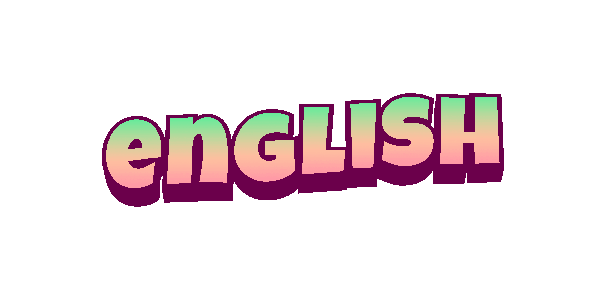

 

  

<h1 align="center" >Привет 👋 я Romà</h1>

my name c греч. Ρωμαϊκή — римлянин, римский (латинского происхождения)

## 🌱 Обо мне
Я простой парень которому нравится проводить время в виртуальном мире и всегда нравилось клацать кнопки на компуктере для создания чего либо.  Всегда хотел иметь свой сайт, где будет рассказано обо мне так как я хочу.

  
  
  

#### ⚡Интересный факт — мне нравится saga Fast and Furios & Vampire Diaries (а так же его сиквелы)

## 💻Learning: 
- [Frontend разработчик на HTML, CSS и JavaScript](https://stepik.org/course/113402/syllabus) 22.08.26 - now
- ✅[Тренажер по вёрстке, плагин Emmet](https://stepik.org/course/113654) 08.09.26 - 30.09.26

## 🛠️ Tech stack который я изучаю

**Frontend**

**Languages**

<!--
**alwaysromka/alwaysromka** is a ✨ _special_ ✨ repository because its `README.md` (this file) appears on your GitHub profile.

Here are some ideas to get you started:

- 🔭 I’m currently working on ...
- 🌱 I’m currently learning ...
- 👯 I’m looking to collaborate on ...
- 🤔 I’m looking for help with ...
- 💬 Ask me about ...
- 📫 How to reach me: ...
- 😄 Pronouns: ...
- ⚡ Fun fact: ...
-->
###